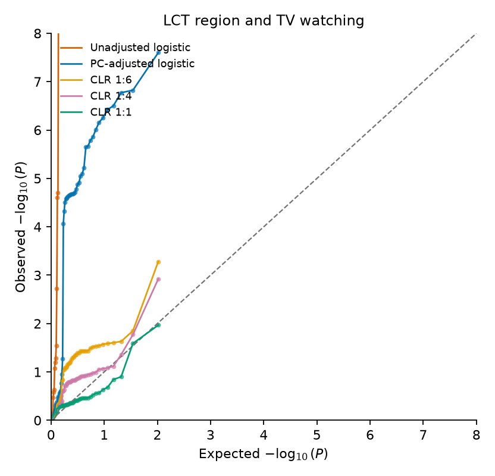
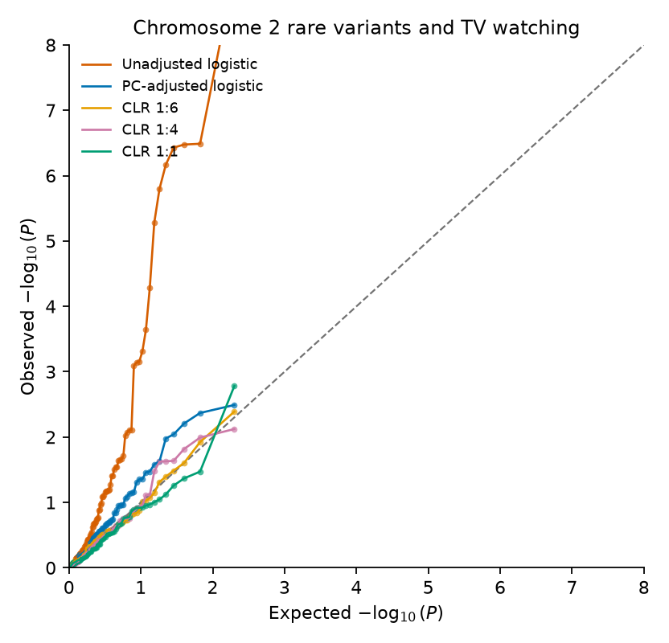
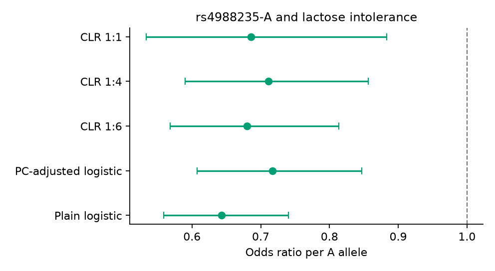
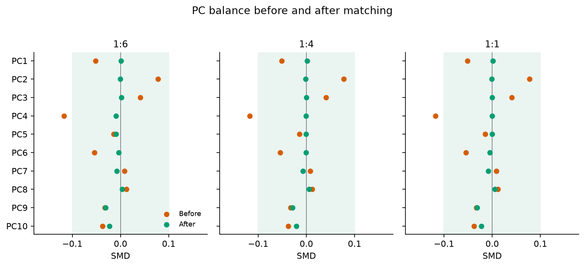
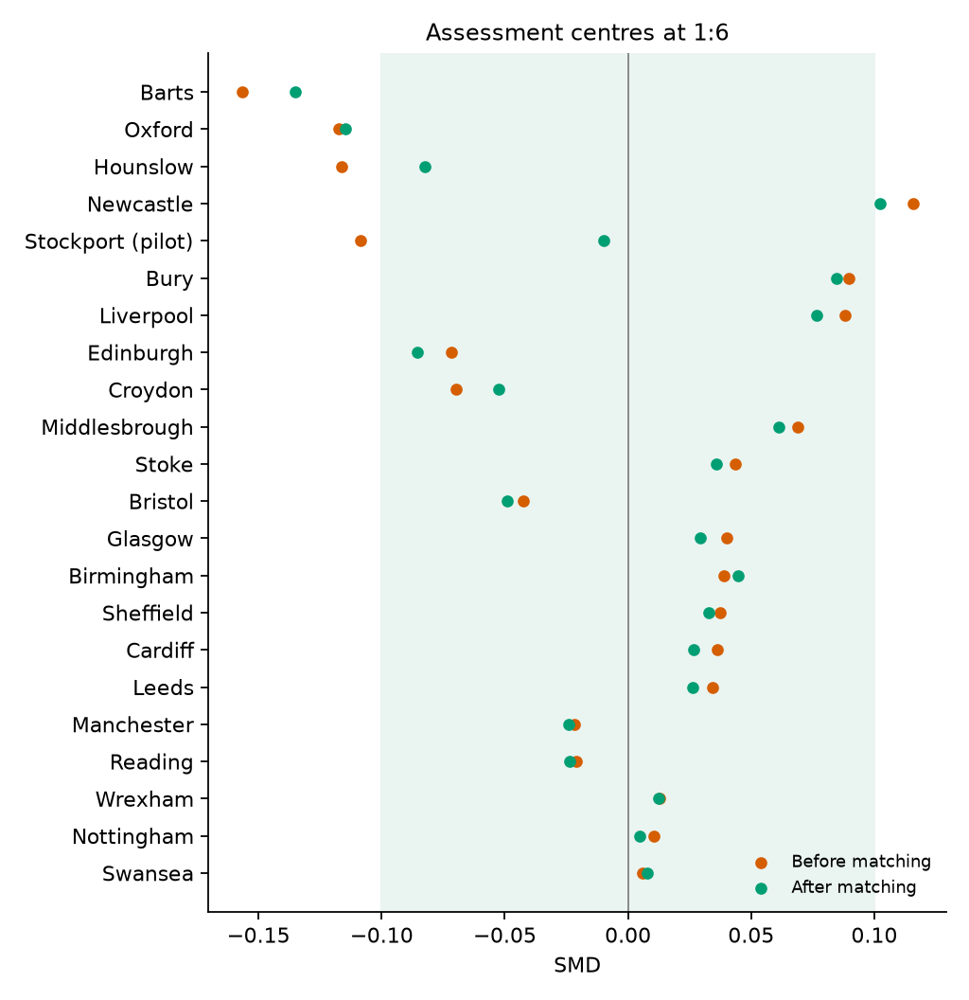
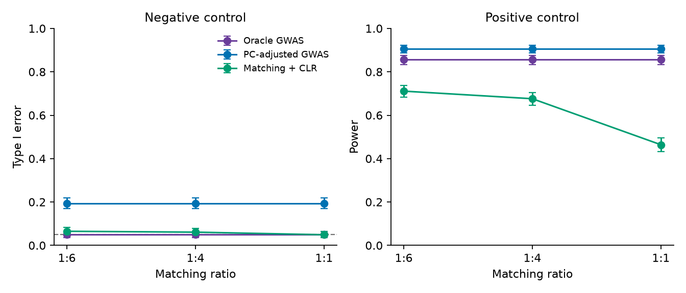

# rare-variants

This repository contains the scripts used for the analyses reported in the paper, together with the variant-level results and other summary tables.

Individual-level UK Biobank genotype and phenotype data are not included. Those data are available to approved researchers under application 98032. The simulation can be run from this repository without UK Biobank access. Files in `summary/` support the reported figures and tables.

[Overview with figures](https://htmlpreview.github.io/?https://github.com/sw4rsw4r/rare-variants/blob/main/rare-variants.html)

